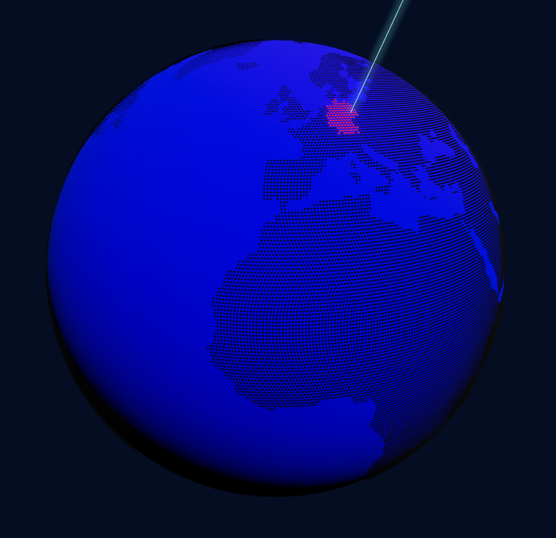

    

        
    

    <h3>world-sphere - Interactive globe component based on three.js</h3>
    
Note: This is still in development

## Current features as of 0.0.1:

-   Display sphere with default tile placement
-   Display sphere with custom tile placement config (be careful: long load times - up to 30 seconds)
-   Highlight countries by hovering over them
-   Display beams on the nearest tiles given specific coordinates

## TODO:

-   Improve hover performance
-   HoverHelper tests
-   Extend customization API
-   Investigate performance loss when using tsup
